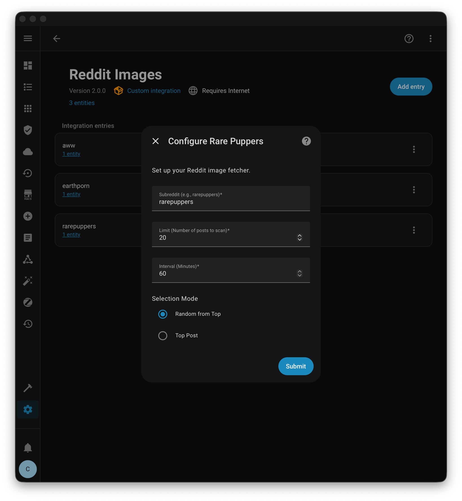
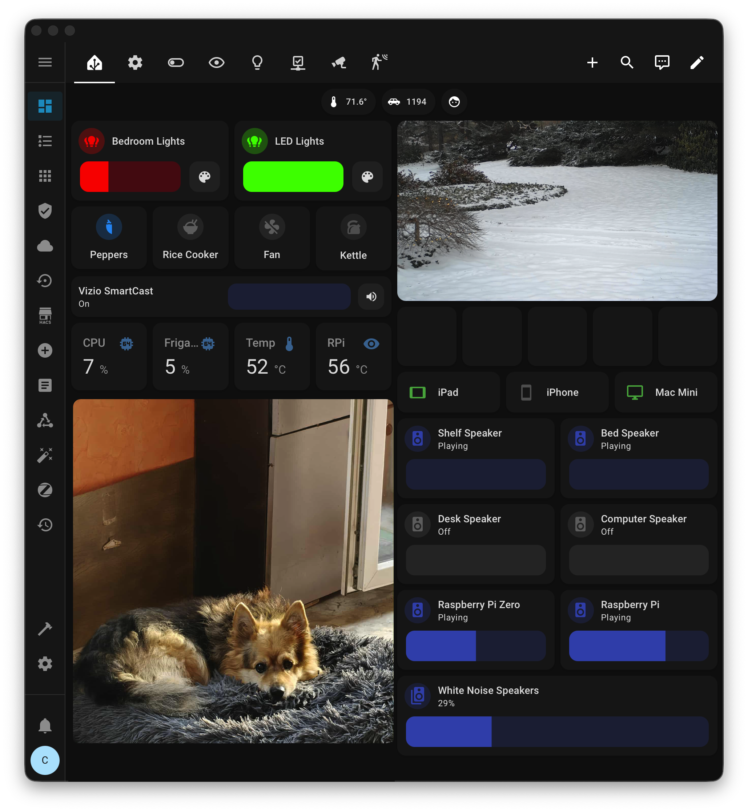
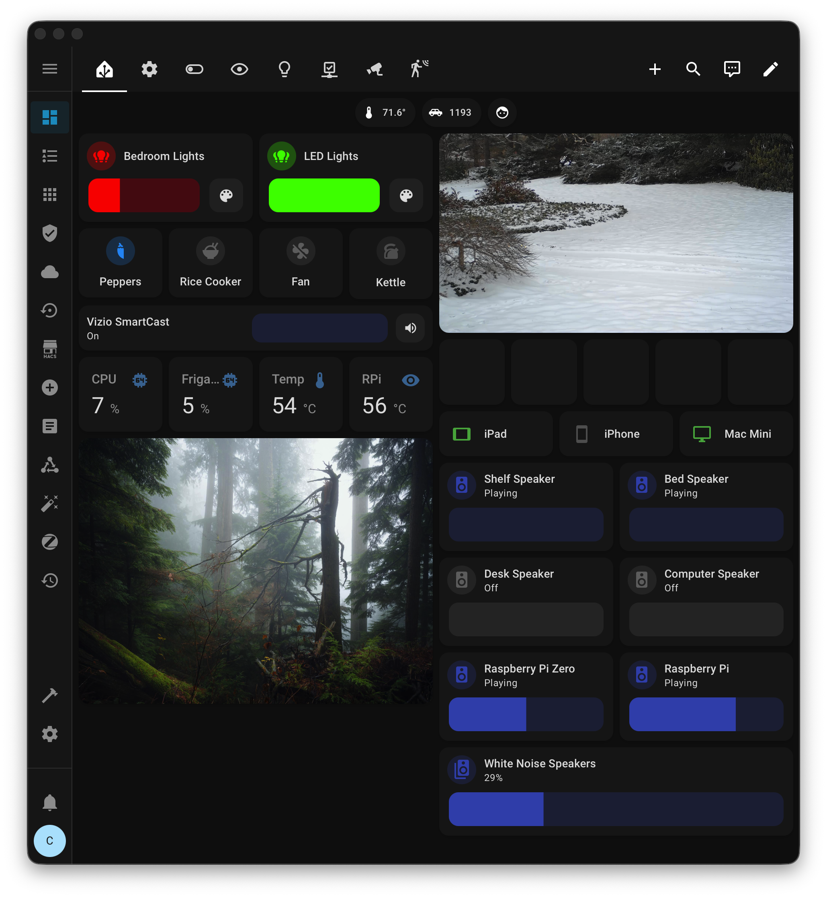
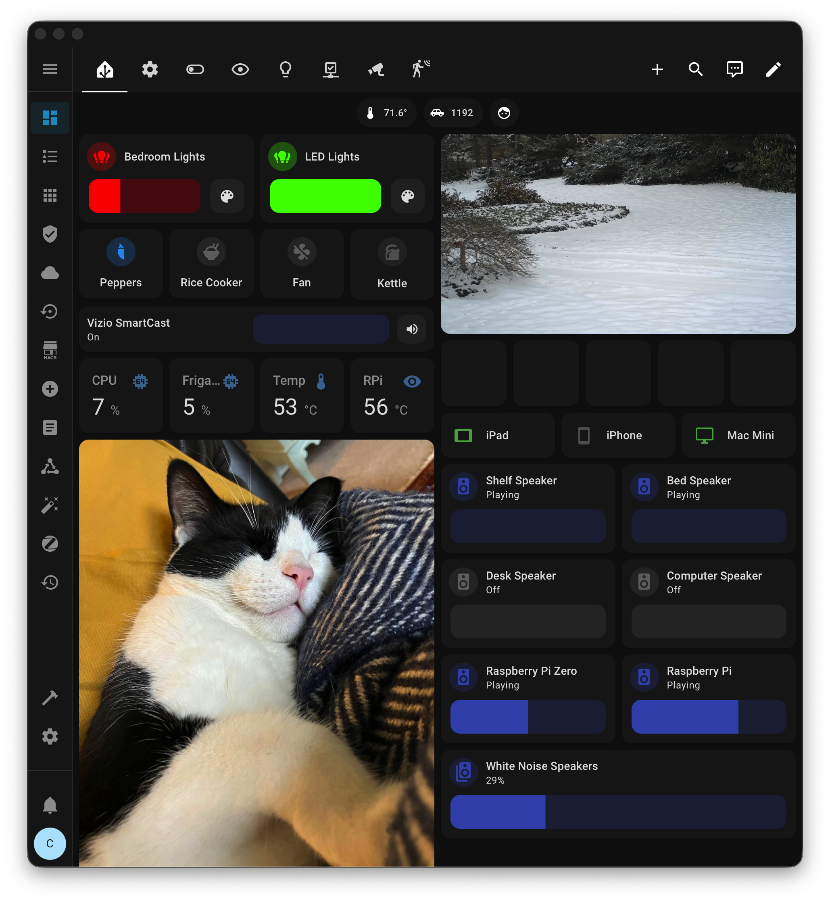

<h1>
  
  Reddit Images
</h1>

<br clear="left"/>

A Home Assistant integration that displays the top images from any subreddit on your dashboard.

## Screenshots

<table>
  <tr>
    <td></td>
    <td></td>
  </tr>
  <tr>
    <td></td>
    <td></td>
  </tr>
</table>

## Features

- Display images from any subreddit
- Configurable update interval
- Choose a random top post or show the #1 post
- Works with `picture-entity` card out of the box
- Add multiple entities for different subreddits

## Installation

### HACS (Recommended)

1. Open HACS in Home Assistant
2. Click the three dots menu (top right) → **Custom repositories**
3. Add this repository URL and select **Integration** as the category
4. Click **Add**
5. Search for "Reddit Images" and install
6. Restart Home Assistant

### Manual Installation

1. Download the `reddit_images` folder from this repository
2. Copy it to your `custom_components` directory
3. Restart Home Assistant

## Configuration

1. Go to **Settings** → **Devices & Services**
2. Click **Add Integration**
3. Search for "Reddit Images"
4. Configure:
   - **Subreddit**: The subreddit to pull images from (e.g., `rarepuppers`, `earthporn`, `aww`)
   - **Limit**: Number of top posts to consider (default: 20)
   - **Interval (Minutes)**: How often to fetch a new image (default: 60)
   - **Selection Mode**:
     - *Random from Top*: Randomly picks an image from the top posts
     - *Top Post*: Always shows the #1 highest-upvoted image

**Tip**: You can add the integration multiple times to create separate entities for different subreddits!

## Usage

Add a `picture-entity` card to your Lovelace dashboard:

```yaml
type: picture-entity
entity: image.reddit_images_rarepuppers
show_name: false
show_state: false
```

Replace `rarepuppers` with your configured subreddit name.

## How It Works

1. Fetches the top posts from the configured subreddit (last 24 hours)
2. Filters for direct image links (.jpg, .jpeg, .png)
3. Selects an image based on your chosen mode (random or top)
4. Updates at your configured interval

## Supported Subreddits

Any public subreddit with image posts! Popular choices:
- `rarepuppers` - Adorable dogs
- `aww` - Cute animals
- `earthporn` - Beautiful landscapes (SFW)
- `spaceporn` - Space and astronomy images
- `itookapicture` - Photography

## Support & Feedback

Found a bug or have a suggestion? Please [open an issue](https://github.com/saihgupr/reddit_images/issues) to report it.

If you like this integration, please give it a star on GitHub! ⭐

## License

MIT License